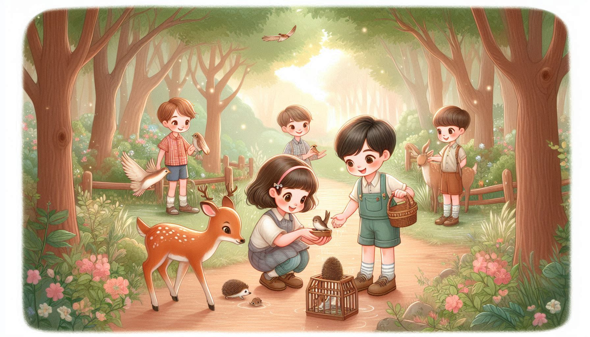

# AI-Generated Stories 📖

**Welcome to the AI-Generated Stories Repository!**  
This repository houses the stories created by our AI system as part of the Ai Novelist initiative. Each story is crafted to educate, inspire, and entertain, with a focus on environmental awareness and sustainability.  

## 🌟 About the Stories

- **Personalized:** Every story is tailored for children, considering their name, age, and specific themes.  
- **Educational:** Each tale conveys actionable lessons about protecting our planet.  
- **Diverse Topics:** Stories cover a wide range of environmental themes such as reducing waste, saving water, and protecting animals.  

## 📂 How the Repository is Organized

- Stories are stored in Markdown format for easy readability and contribution.  
- Stories are categorized by themes and topics, making it easy to find and explore relevant content.  

## 🌈 How to Contribute

We welcome writers, educators, and developers to enhance this repository.  
- **Submit new stories:** Create stories in Markdown format and submit via pull requests.  
- **Review stories:** Help improve the quality of the stories.  

## Explore Our Topics

We’ve divided our stories into the following environmental themes. Click on the links below to discover exciting stories and images for each topic:

### 🌬️ [Air Pollution Reduction](./kids/Air%20Pollution%20Reduction)
  
*Explore ways to reduce air pollution and keep our skies clear!*

### 🐾 [Animal Protection](./kids/Animal%20Protection)
  
*Learn how we can protect animals and their habitats.*

### 🌳 [Tree Preservation](./kids/Tree%20Preservation)
  
*Discover the importance of trees and why we must preserve them.*

### ♻️ [Waste Reduction](./kids/Waste%20Reduction)
  
*Reduce, reuse, and recycle! Let’s make the world cleaner for future generations.*

### 💧 [Water Conservation](./kids/Water%20Conservation)
  
*Saving water is one of the simplest ways to protect our planet.*

Explore and share these stories with children to spread environmental awareness. Together, we can inspire the next generation to care for our planet!  
