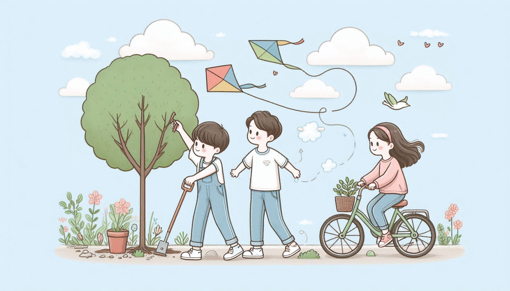
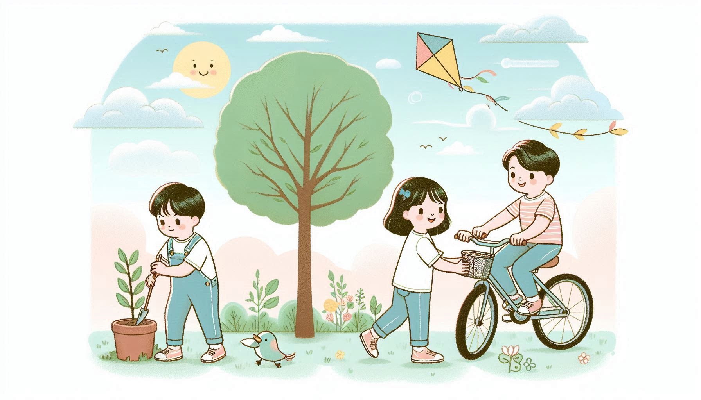
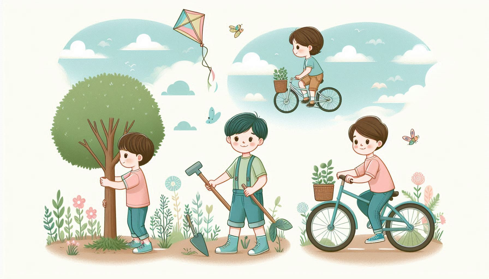
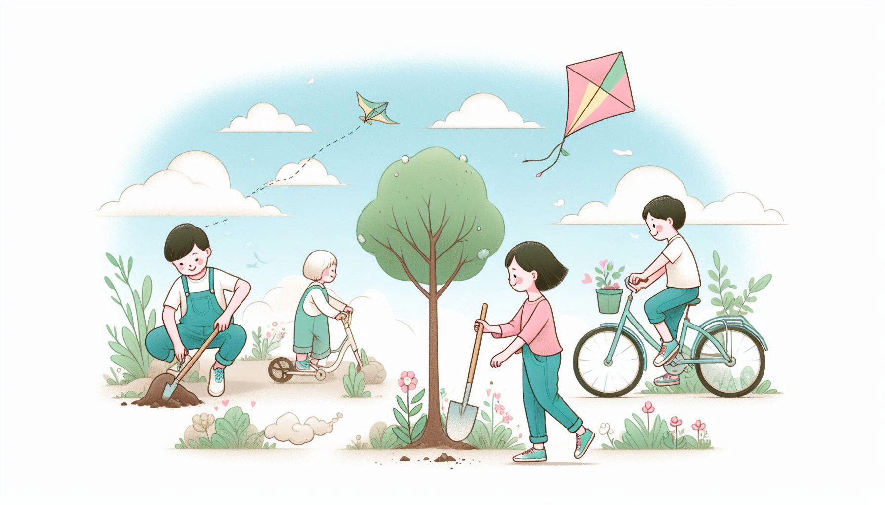

# Air Pollution Reduction 🌬️

This folder features stories and visuals designed to engage children with the theme of **reducing air pollution**. Each story sparks curiosity, creativity, and action to help protect our environment.

## 🌟 Inspiring Images  

The following images represent children and their connection to the theme of air pollution reduction. These visuals aim to inspire and set the tone for the stories in this folder:

  
*Kids working together for cleaner air.*  

  
*Imagining a world with fresh, pollution-free skies.*  

  
*Small actions making a big difference in air quality.*  

  
*A reminder that every child can be an environmental hero.*  

---

Dive into the stories and let the imagination and lessons within these tales inspire children to contribute to a healthier planet!  
