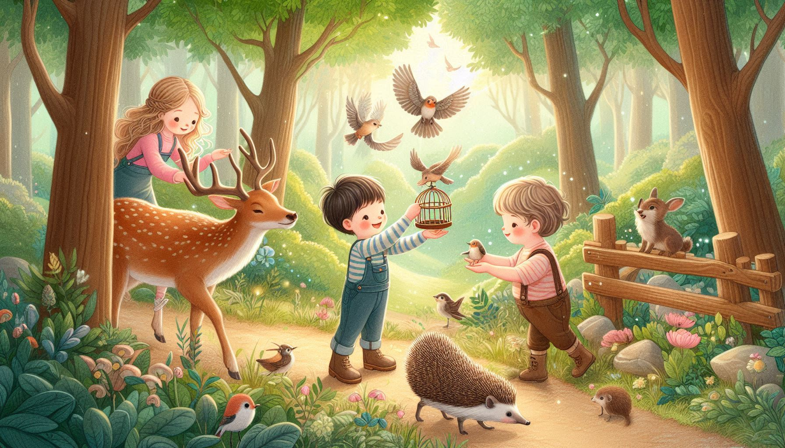
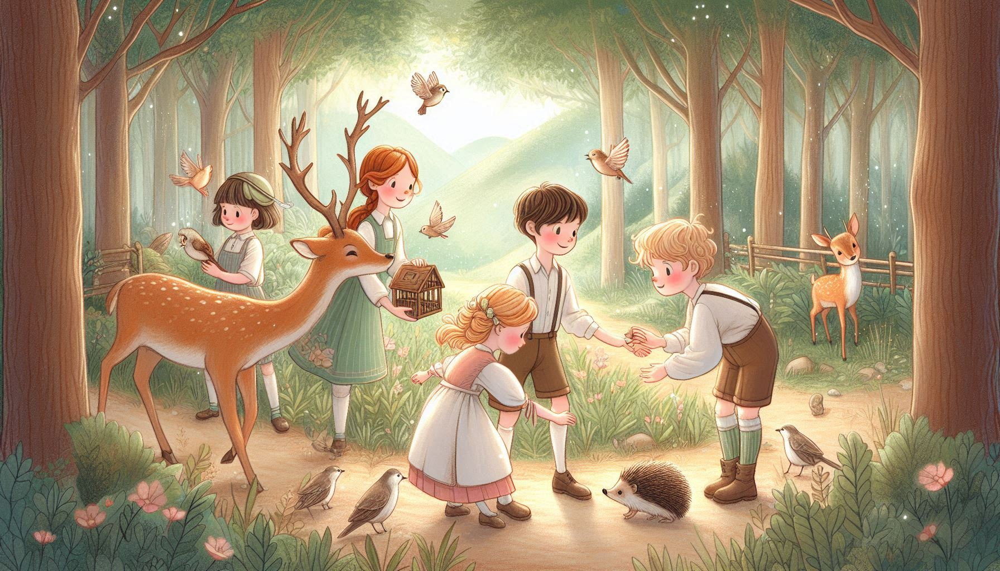
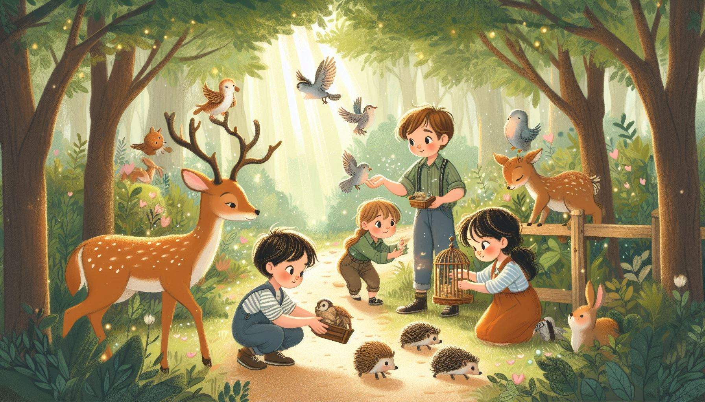

# Animal Protection 🐾

This folder highlights the theme of **protecting animals**. The stories here inspire children to appreciate wildlife and take small steps to ensure animals live in a safe and healthy environment.

## 🌟 Inspiring Images  

The following images represent children engaging with the idea of animal protection, sparking their curiosity and compassion:

  
*Every child can be a friend to animals.*  

  
*Learning to live in harmony with nature.*  

  
*Protecting wildlife for a brighter future.*  

  
*Let’s be the voice for the voiceless.*  

---

Explore the stories and inspire young minds to stand up for animals and their habitats!  
