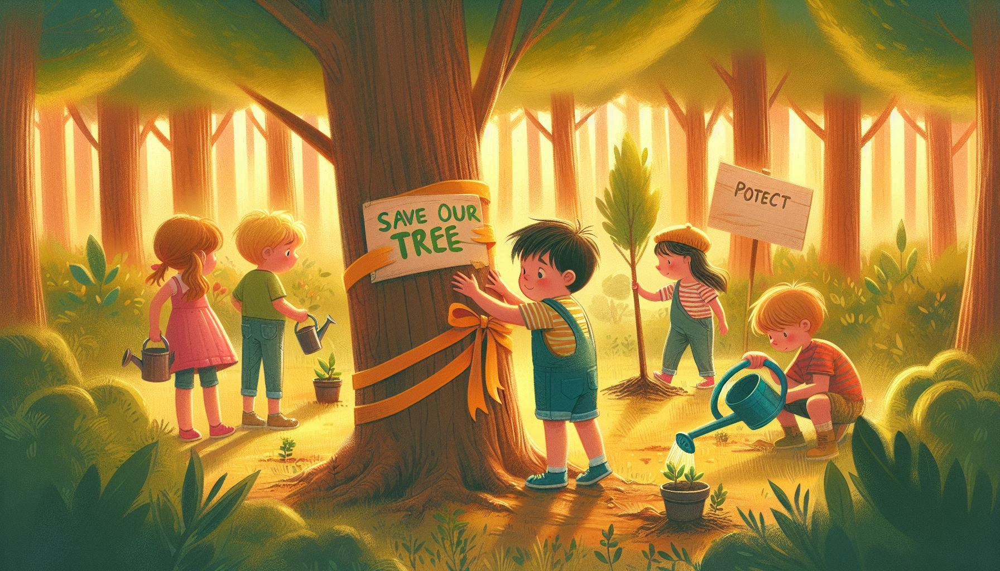
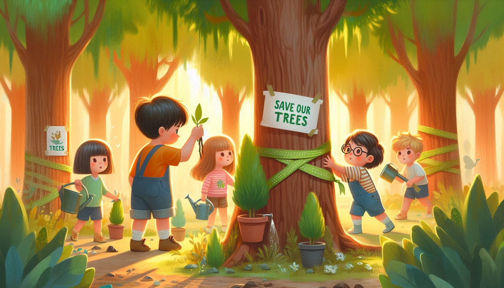
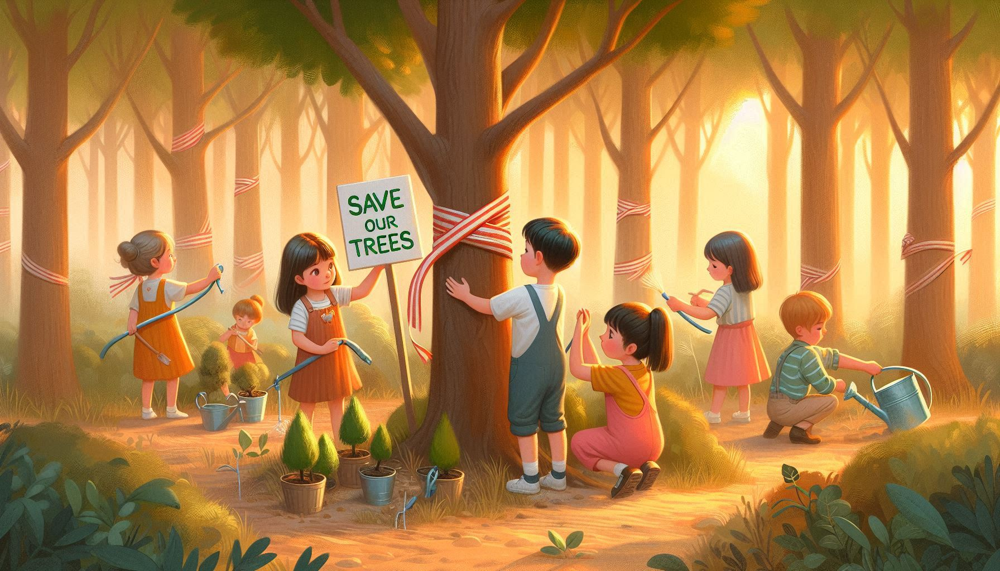
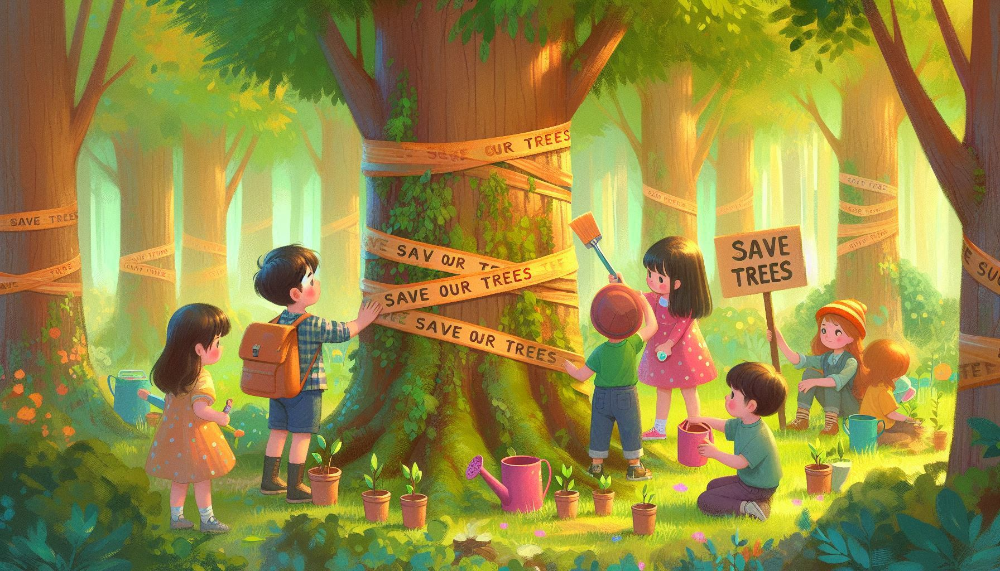

# Tree Preservation 🌳

This folder focuses on **preserving trees** and fostering a love for greenery. Through these stories, children learn the importance of trees and how they contribute to a healthier planet.

## 🌟 Inspiring Images  

Below are images that celebrate the theme of tree preservation, encouraging children to take care of our green friends:

  
*Planting the seeds of a greener future.*  

  
*Every tree makes the world a better place.*  

  
*Kids discovering the magic of nature.*  

  
*Together, we can save the trees!*  

---

Discover the stories in this folder and help inspire children to be guardians of our forests and jungles!  
