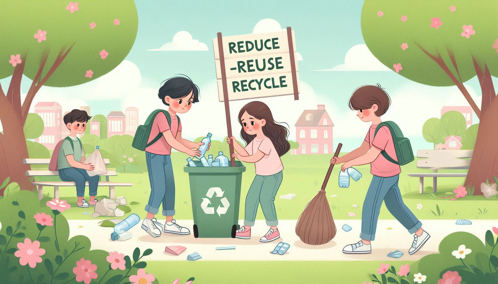
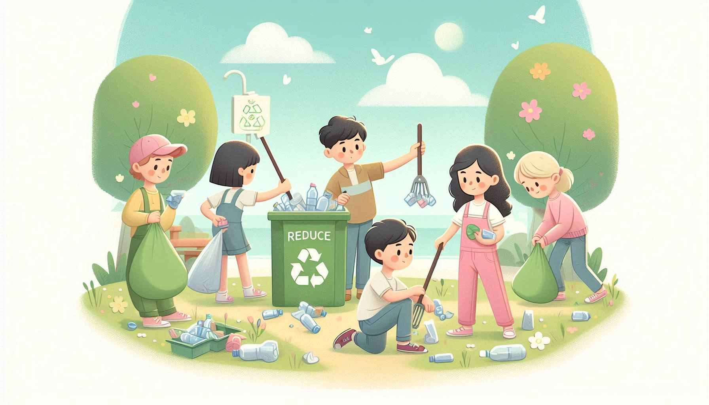
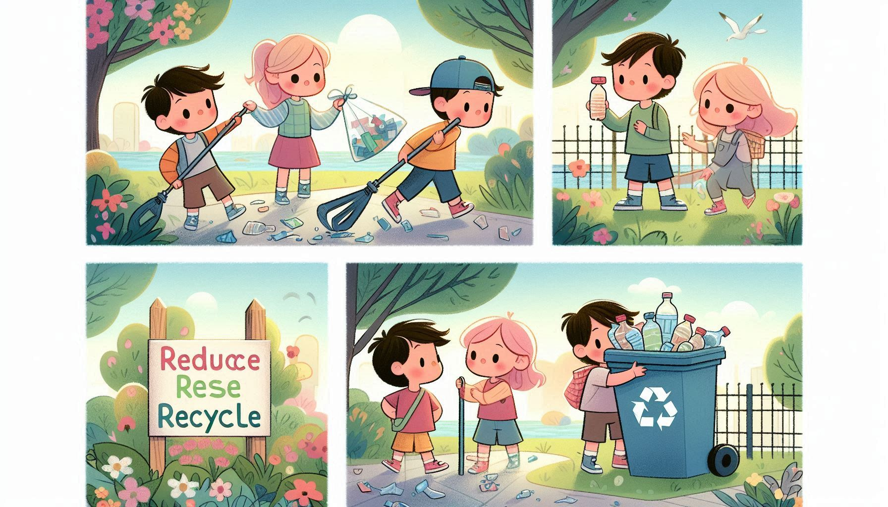
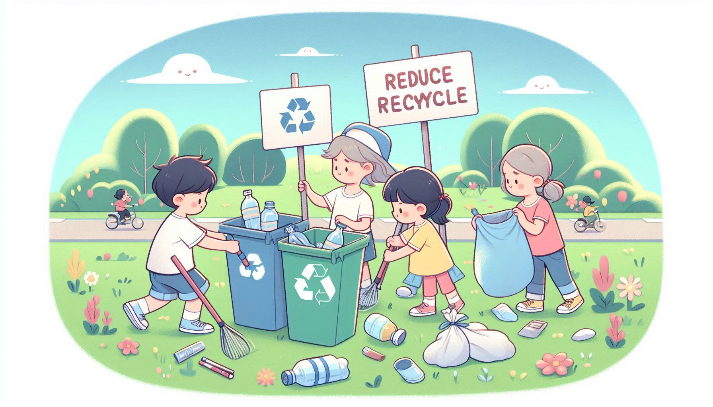

# Waste Reduction ♻️

This folder emphasizes the importance of **reducing waste** and rethinking our daily habits. The stories here encourage children to make small changes that have a big impact on the environment.

## 🌟 Inspiring Images  

The following images illustrate the theme of waste reduction and how children can contribute to a cleaner planet:

  
*Sorting waste to keep the planet clean.*  

  
*Learning the three R's: Reduce, Reuse, Recycle.*  

  
*Every effort counts in reducing waste.*  

  
*Join hands to clean up our world.*  

---

Let these stories inspire children to become mindful consumers and waste warriors!  
