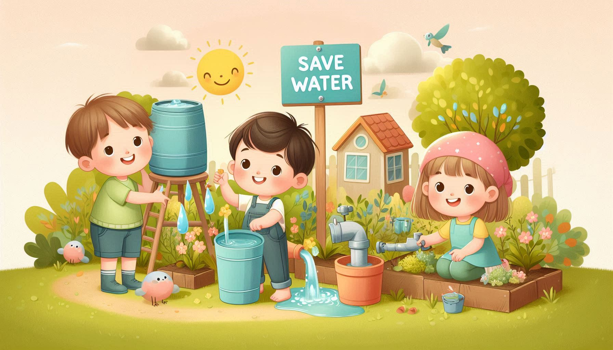
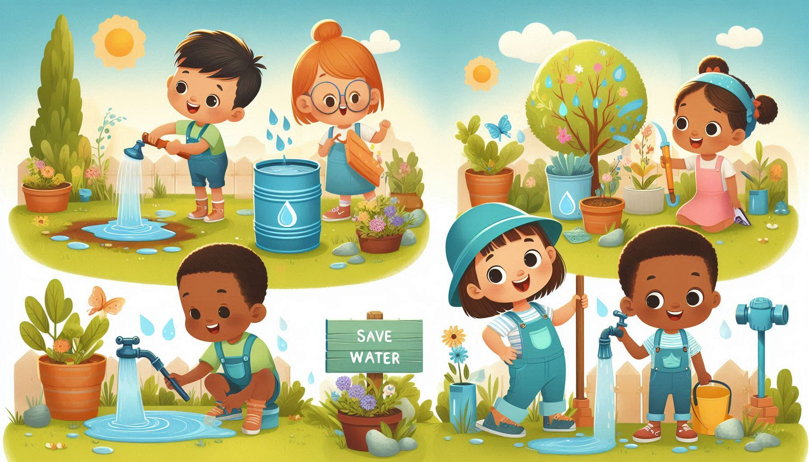
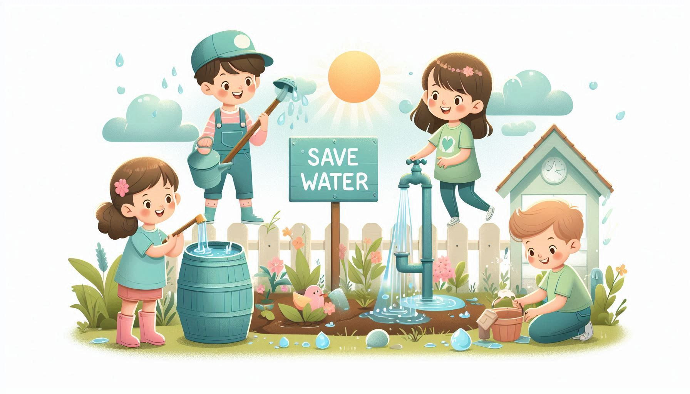
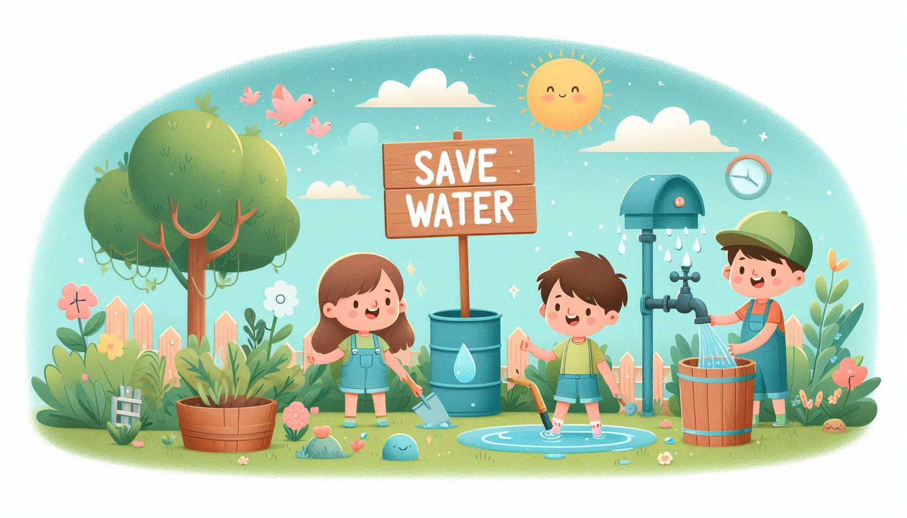

# Water Conservation 💧

This folder revolves around the theme of **conserving water**, teaching children about the value of this precious resource and how they can help save it.

## 🌟 Inspiring Images  

Below are images that capture the essence of water conservation and encourage children to play an active role in preserving it:

  
*Saving every drop for a better tomorrow.*  

  
*Kids learning to value clean water.*  

  
*Protecting rivers, lakes, and oceans together.*  

  
*Water is life—let’s conserve it!*  

---

Dive into the stories here and inspire children to become water-saving heroes in their communities!  
